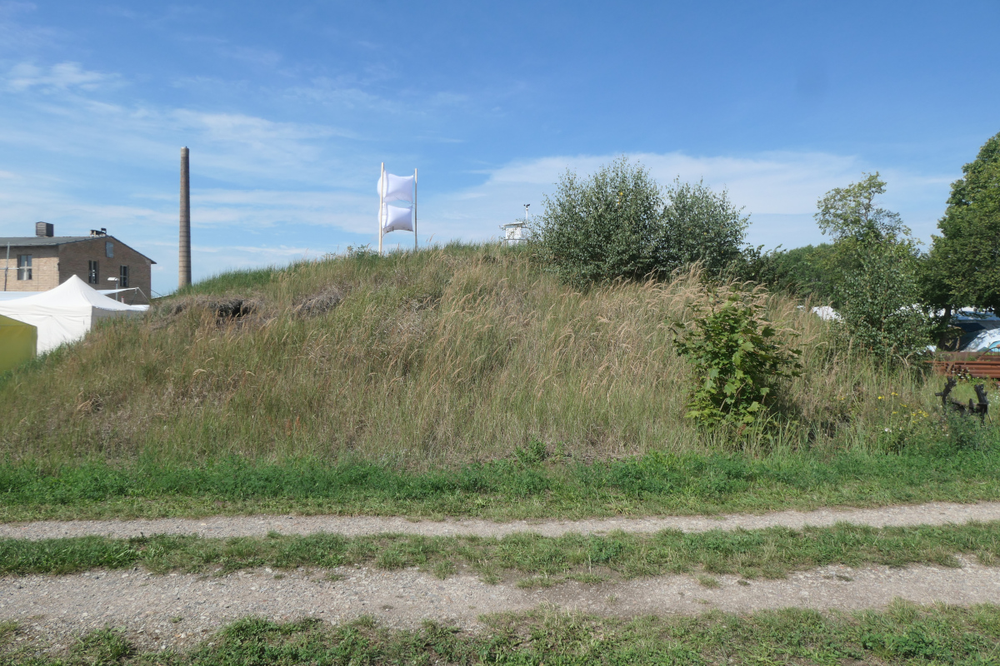
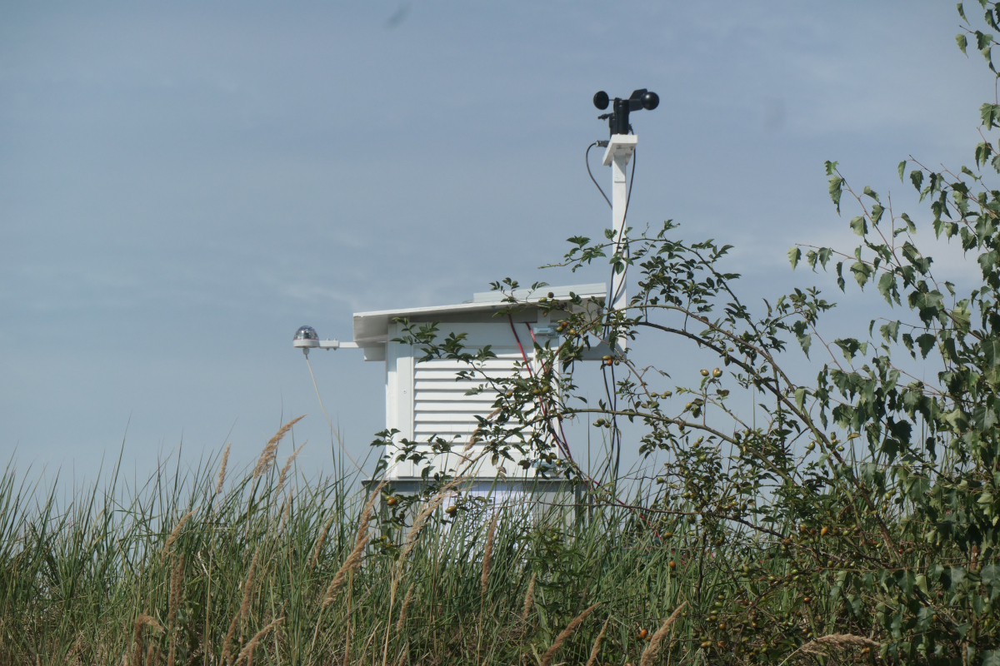

# mobile weatherstation project

## Intro and status

The goal of this project is to build a weatherstation, that can be
transported to events, like Chaos Communication Camp, or to
whatever-the-successor-to-MCH2022-will-be-called.

The long term hope is that also a stationary variant of this can be put up
in the outskirts of Erlangen, to provide proper local measurements - the main
showstopper here is to find a suitable location. These long term plans are why
this weather station tries to use LTE (in its IOT variants) and not the WiFi
that would normally be available at chaos- and similiar events. That this means
the weather station can already work before any infrastructure is in place is
an additional plus.

More info might be in the `docs` directory, more specifically `docs/unstructuredmess.md`.

As of August 2023, we have built a somewhat working version. There were certainly
a lot of bugs still to iron out, the case was not properly finished, and it had
no feet yet which is why it needed to be placed on a plastic box, but it
was ready for a first limited test run at CCCamp23. The result of that test run
can be seen in https://wetter.poempelfox.de/static/camp2023.html

## Features

* solar powered - large solar panel on the roof, and an AGM battery for storage
* sends its measurement data out through LTE (IOT variants) or 2G mobile networks
* can measure the following
  - temperature
  - humidity
  - pressure
  - particulate matter
  - wind direction
  - wind speed (with limitations)
  - ambient light
  - ultraviolet light (UV index)
* management interface on WiFi

## People

The following people contributed mayor parts to this project, in alphabetical order:

* arw (woodwork, assembly)
* PoempelFox (firmware, all parts of the hardware powered by electricity)
* str3yt (woodwork, assembly)

